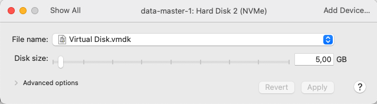

## CREATE A DATA MANAGEMENT CLUSTER HA WITH ARCHITECTURE AS BELOW


> &#8505;&#65039; **INFO**
>  GlusterFS is a network file system that can scale up to serveral petabyte and handle thousands of clients. This is an open source distributed data management system. It puts data which needs to be stored from many different servers into one memory area, also known as namespace.


#### Add host on 3 servers
````bash
echo -e "192.168.195.14 data-master-1\n192.168.195.15 data-master-2\n192.168.195.16 data-master-3" | sudo tee -a /etc/hosts
````

#### Create a sharing disk to ensure data isn't lost (5gb for sharing disk)



#### List all disk information of VM
````bash
lsblk
````


#### Partition for disk 2 and mount on all servers -> Mount sharing disk to server directory
````bash
sudo mkfs.ext4 -m 0 /dev/nvme0n2
sudo mkdir -p /data
echo "/dev/nvme0n2 /data ext4 defaults 0 0" | sudo tee -a /etc/fstab # Mount sharing disk to created directory
sudo mount -a
sudo df -h
````


#### Installation GlusterFS on 3 servers
````bash
sudo apt install glusterfs-server -y
sudo systemctl start glusterd && sudo systemctl enable glusterd
````

#### Set up peer among GlusterFS servers on data-master-1 -> peer is a node which participates in distributed data management -> all peers connect together that created into "trusted storage pool."
````bash
sudo gluster peer probe data-master-2
sudo gluster peer probe data-master-3
sudo gluster peer status
sudo gluster volume create vol_storage replica 3 transport tcp data-master-1:/data/storage data-master-2:/data/storage data-master-3:/data/storage
sudo gluster volume start vol_storage
ls -lrRa /data
````

#### Grant permission on 3 servers
````bash
sudo chown -R nobody:nogroup /data/
````

#### There are two ways to connect to created data management system

##### Method 1: Use GlusterFS Client directly
###### Use a different VM for testing

````bash
echo "192.168.195.14 data-master-1\n192.168.195.15 data-master-2\n192.168.195.16 data-master-3" >> /etc/hosts
apt install glusterfs-client -y
mkdir /data/test
mount -t glusterfs data-master-1:vol_storage /data/test
touch /data/test/test_file.txt
````

###### If you want to unmount from current VM with cluster
````bash
umount /data/test/
````

#### Method 2: Use GlusterFS + NFS
##### Disable nfs mode on GlusterFS
````bash
sudo gluster volume set vol_storage nfs.disable off
````

#### Install nfs server on 3 servers
````bash
sudo apt install nfs-kernel-server -y
````

#### Add configuration into /etc/exports
````bash
echo "/data/storage/ *(rw,sync,no_subtree_check,fsid=0)" | sudo tee -a /etc/exports
sudo exportfs -ra
````

#### Install HA proxy using keepalive

[Implement HA serivce with Keepalived & HAproxy on ubuntu server](https://viblo.asia/p/trien-khai-dich-vu-high-available-voi-keepalived-haproxy-tren-server-ubuntu-jOxKdqWlzdm)

````bash
sudo apt install keepalived -y
sudo systemctl start keepalived 
sudo systemctl enable keepalived
````

##### Config on server data-master-1 with role MASTER
````bash
ip a # use this command to see networkk interface
````


````bash
echo "vrrp_instance VI_1 {  
    state MASTER  
    interface ens160  
    virtual_router_id 51  
    priority 100  
    advert_int 1  
    authentication {  
        auth_type PASS  
        auth_pass 123456789  
    }  
    virtual_ipaddress {  
        192.168.195.17/24  
    }  
}" | sudo tee /etc/keepalived/keepalived.conf

sudo systemctl restart keepalived
````

##### Proceed on server data-master-2 with role BACKUP
````bash
echo "vrrp_instance VI_1 {  
    state BACKUP  
    interface ens160  
    virtual_router_id 51  
    priority 90  
    advert_int 1  
    authentication {  
        auth_type PASS  
        auth_pass 123456789  
    }  
    virtual_ipaddress {  
        192.168.195.17/24  
    }  
}" | sudo tee /etc/keepalived/keepalived.conf

sudo systemctl restart keepalived
````
##### Proceed on server data-master-3 with role BACKUP
````bash
echo "vrrp_instance VI_1 {  
    state BACKUP  
    interface ens160  
    virtual_router_id 51  
    priority 80  
    advert_int 1  
    authentication {  
        auth_type PASS  
        auth_pass 123456789  
    }  
    virtual_ipaddress {  
        192.168.195.17/24  
    }  
}" | sudo tee /etc/keepalived/keepalived.conf

sudo systemctl restart keepalived
````


> &#8505;&#65039; **INFO**
>  VIP should be only displayed on MASTER in case everything is normal and only displayed on the BACKUP servers when the MASTER dies

##### When we have VIP that we can create another directory and mount glusterfs directory into it
````bash
sudo mkdir /data/nfs-shared
sudo chown -R nobody:nogroup /data/nfs-shared
sudo mount -t glusterfs 192.168.195.17:/vol_storage /data/nfs-shared # proceed on data-master-1
sudo systemctl restart nfs-kernel-server
````

#### Add configuaration /etc/exports on data-master-1
````bash
echo "/data/nfs-shared/ *(rw,sync,no_subtree_check,fsid=0)" | sudo tee -a /etc/exports
sudo exportfs -ra
````

#### On another server is used to test
````bash
Cài đặt nfs client
sudo apt install nfs-common -y
sudo mkdir -p /data/test
mount 192.168.195.17:/data/nfs-shared /data/test
````