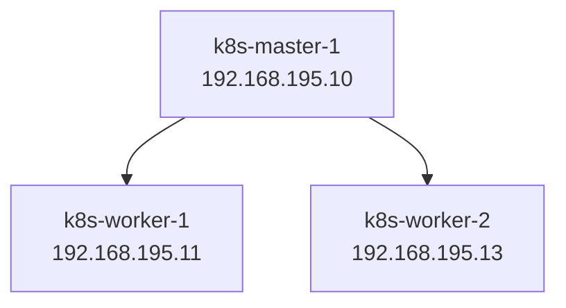

## Build a k8s cluster with 3 nodes following kubespray method



#### Create three virtual machines with Ubuntu 22.04 following:

|     **Node**     |   **IP Address**   |	  **Roles**    |
|:----------------:|:------------------:|:----------------:|
| k8s-master-1     | 192.168.195.10     |	Control plane  |
| k8s-worker-1     | 192.168.195.11     |	Worker         |
| k8s-worker-2     | 192.168.195.13     |	Worker         |

#### Config static IP for virtual machines
1. Using **sudo nano /etc/netplan/file.yaml** to turn off dhcp mode and set up static IP.
```bash
network:
  version: 2
  ethernets:
    ens160:
      dhcp4: yes
      addresses: [192.168.195.10/24]
      gateway4: 192.168.195.2
      nameservers:
          addresses: [8.8.8.8, 8.8.4.4]
```
2. **sudo netplan apply** to apply the configuration.
3. **su -i**
4. Enable ssh for root user: **sudo nano /etc/ssh/sshd_config** , uncomment line: **PermitRootLogin yes** and **PasswordAuthentication yes** =>  Using command **systemctl  restart ssh**
5. To set password for **root** user using **passwd** command

#### Next step will install some tools such as ansible on master
````bash
apt update -y && apt upgrade -y
apt install git python3 python3-pip -y
apt install ansible-core -y
````

> &#9888;&#65039; **CAUTION** Check current version of ansible using **ansible version** command. Require ansible version **2.14+** that can install **k8s v1.28**

#### To automatically install that k8s-master-1 has to connect to  k8s-worker-1 and k8s-worker-2 through public key

1. Generate a key on k8s-master-1
````bash
ssh-keygen -t rsa -b 4096
````

2. Copy key from master to other worker nodes
````bash
ssh-copy-id root@192.168.195.11
ssh-copy-id root@192.168.195.13
````

#### Turning off swapoff
````bash
sudo swapoff -a
sudo sed -i '/swap.img/s/^/#/' /etc/fstab
````

4. Config module kernel and downloading them.
````bash
sudo tee /etc/modules-load.d/containerd.conf << EOF
overlay
br_netfilter
EOF
````

#### Clone the source code from git: [https://github.com/kubernetes-sigs/kubespray.git --branch release-2.24](https://github.com/kubernetes-sigs/kubespray.git) 

````bash
cd kubespray
cp -rfp inventory/sample inventory/mycluster
````

#### In inventory/cluster file, create a file with name hosts.ini with conent
````markdown
[all]
k8s-master-1  ansible_host=192.168.195.10  ip=192.168.195.10
k8s-worker-1  ansible_host=192.168.195.11  ip=192.168.195.11
k8s-worker-2  ansible_host=192.168.195.13  ip=192.168.195.13

[kube-master]
k8s-master-1

[kube-node]
k8s-master-1
k8s-worker-1
k8s-worker-2

[etcd]
k8s-master-1

[k8s-cluster:children]
kube-node
kube-master

[calico-rr]

[vault]
k8s-master-1
````

#### Use ( ansible-playbook -i inventory/mycluster/hosts.ini --become --become-user=root cluster.yml ) to install the cluster

> &#9888;&#65039; **CAUTION** If error during run process, use **ansible-playbook -i inventory/mycluster/hosts.ini  --become --become-user=root reset.yml** to reset cluster

> &#10060; **BUG**
> -	Use **kubectl get po -A** that see crashloopbackoff error on 2 pod of coredns => Edit and mount to namservers of google.
> -	**kubectl edit configmap coredns -n kube-system** edit part **forward . /etc/resolv.conf** to **forward . 8.8.8.8 8.8.4.4**
> -	Restart using command **kubectl rollout restart deployment coredns -n kube-system**