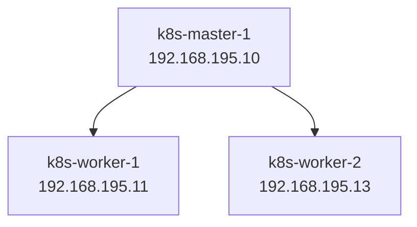

## Build a k8s cluster with 3 nodes as master and worker.



### Create three virtual machines with Ubuntu 22.04 following:

|     **Node**     |   **IP Address**   |	  **Roles**    |
|:----------------:|:------------------:|:----------------:|
| k8s-master-1     | 192.168.195.10     |	Control plane  |
| k8s-worker-1     | 192.168.195.11     |	Worker         |
| k8s-worker-2     | 192.168.195.13     |	Worker         |

#### Config static IP for virtual machines
1. Using **sudo nano /etc/netplan/file.yaml** to turn off dhcp mode and set up static IP.
```bash
network:
  version: 2
  ethernets:
    ens160:
      dhcp4: no
      addresses: [192.168.195.10/24]
      gateway4: 192.168.195.2
      nameservers:
          addresses: [8.8.8.8, 8.8.4.4]
```
2. **sudo netplan apply** to apply the configuration.
3. Create a new user **k8s** for all nodes using **adduser k8s** command.
4. Grant **sudo** permission for **k8s** user => Using **visudo** and add **k8s    ALL=(ALL:ALL) ALL**.
5. Pass to user k8s using **su k8s** command.

### Next step will proceed to install k8s tools and CRI.

> &#8505;&#65039; **INFO**
>  **All services on k8s using following ports:**
>  - kube API service: 6443
>  - kubelet: 10250
>  - etcd: 2379 and 2380
>  - ingress: 80 or 443


1. Turn off the swapoff because kubernetes needs real ram to ensure accurate pod scheduling and performance. 
> **sudo swapoff -a**  
> **sudo sed -i '/swap.img/s/^/#/' /etc/fstab**  

2. Config module kernel and downloading them.
````bash
sudo tee /etc/modules-load.d/containerd.conf << EOF
overlay
br_netfilter
EOF
````


> **sudo modprobe overlay**
> **sudo modprobe br_netfilte**

3. Set up brigde network which helps traffic is processed by linux iptables firewall rules and enable port fowarding.
````bash
sudo tee /etc/sysctl.d/kubernetes.conf << EOF
net.bridge.bridge-nf-call-ip6tables=1
net.bridge.bridge-nf-call-iptables=1
net.ipv4.ip_forward=1
net.ipv6.ip_forward=1
EOF
````

Apply this config using **sudo sysctl --system**

4. Add some appropriate packages and docker repo.
````bash
sudo apt install -y curl gnupg2 software-properties-common apt-transport-https ca-certificates

sudo curl -fsSL https://download.docker.com/linux/ubuntu/gpg | sudo gpg --dearmour -o /etc/apt/trusted.gpg.d/docker.gpg

sudo add-apt-repository "deb [arch=arm64] https://download.docker.com/linux/ubuntu $(lsb_release -cs) stable"
````

5. Install containerd, config and start it.
````bash
sudo apt update -y
sudo apt install -y containerd.io

containerd config default | sudo tee /etc/containerd/config.toml >/dev/null 2>&1
sudo sed -i 's/SystemdCgroup = false/SystemdCgroup = true/g' /etc/containerd/config.toml

sudo systemctl restart containerd
sudo systemctl enable containerd
````

6. Add kubernetes repository and install k8s tools.
````bash
echo "deb [signed-by=/etc/apt/keyrings/kubernetes-apt-keyring.gpg] https://pkgs.k8s.io/core:/stable:/v1.30/deb/ /" | sudo tee /etc/apt/sources.list.d/kubernetes.list
  
curl -fsSL https://pkgs.k8s.io/core:/stable:/v1.30/deb/Release.key | sudo gpg --dearmor -o /etc/apt/keyrings/kubernetes-apt-keyring.gpg

sudo apt update -y

sudo apt install -y kubelet kubeadm kubectl
sudo apt-mark hold kubelet kubeadm kubectl # This command helps keep stable version while repo updated
````

#### Specific an endpoint for cluster and configuration networking.
##### On k8s-master-1 run:
````markdown
sudo kubeadm init
````

##### And create a file to store config

````bash
mkdir -p $HOME/.kube
sudo cp -i /etc/kubernetes/admin.conf $HOME/.kube/config
sudo chown $(id -u):$(id -g) $HOME/.kube/config
````

##### On other nodes run command displayed on master 1 to join into cluster
````bash
kubeadm join <ip>:6443 --token <token> \
	--discovery-token-ca-cert-hash <sha:>
````

##### Install network for node from NotReady  to Ready ( proceed on k8s-master-1 )
````bash
kubectl apply -f https://raw.githubusercontent.com/projectcalico/calico/v3.25.0/manifests/calico.yaml
````

##### List all nodes
````bash
kubectl get nodes
````

----
### To reset cluster apply these commands on all nodes
````bash
sudo kubeadm reset -f
sudo rm -rf /var/lib/etcd
sudo rm -rf /etc/kubernetes/manifests/*
````
